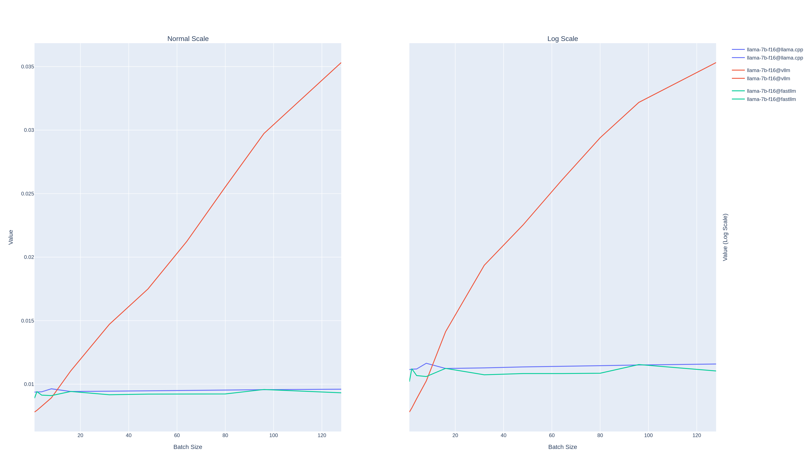

# llm_inference_engine_benchmark
This repository aims to evaluate various open-source inference frameworks, analyzing their strengths and weaknesses.

Thanks for the res: [pandada8/llm-inference-benchmark: LLM 推理服务性能测试 (github.com)](https://github.com/pandada8/llm-inference-benchmark/tree/master)
https://github.com/ninehills/llm-inference-benchmark

## Information

- **Hardware**: Nvidia H800
- **LLM model**: `llama2` 
- **llm inference engine**:  [llama.cpp](https://github.com/ggerganov/llama.cpp), vllm, fastllm
- **指标**: 
  - `Thoughtput`
  -  `none-first Token Latency`
  -  `First Token Latency`


## Run

### llama.cpp

- In the `llama.cpp` directory, run the llama.cpp server.

```bash
~/code/llama.cpp$ CUDA_VISIBLE_DEVICES=0 ./server --n-gpu-layers 999 --host 127.0.0.1 --port 8082 -m models/llama-2-7b/llama-2-7b-7B-F16.gguf
```

`--n-gpu-layers` the number of layer load to GPU. Set `999` making all layers load to GPU.  

`--host` Set the hostname or ip address to listen. Default `127.0.0.1`.

 `--port`  Set the port to listen. Default: `8080`

`-m` The model path.

more parameters and detail can be learned from: [llama.cpp](https://github.com/ggerganov/llama.cpp) and [llama.cpp-server](https://github.com/ggerganov/llama.cpp/tree/master/examples/server) and other [literature](https://discuss.linuxcontainers.org/t/ai-tutorial-llama-cpp-and-ollama-servers-plugins-for-vs-code-vs-codium-and-intellij/19744).

- In the `llm_inference_engine_benchmark` directory, run the test code for llama.cpp.

```bash
python benchmark.py --model llama --backend llama.cpp --endpoint http://127.0.0.1:8082

## draw the result
python draw.py
```

`--endpoint` The endpoint for the server.

`--model` `llama` meanings the family of llama.


### vllm
- run the vllm serve
  
```bash
python -m vllm.entrypoints.openai.api_server  --model model_executor/models/Llama-2-7b-hf/ --host 127.0.0.1 --port 8082
```

- run the test code for vllm.
```bash
python benchmark.py --model llama --backend vllm --endpoint http://127.0.0.1:8082
```

### fastllm
- run the fastllm serve
  
```bash
~/code/fastllm/build$ ./webui -p ../mode_zoo/llama2-7b.flm --port 8082
```

- run the test code for fastllm.
```bash
python benchmark.py --model llama --backend fastllm --endpoint http://127.0.0.1:8082
```

## Result





